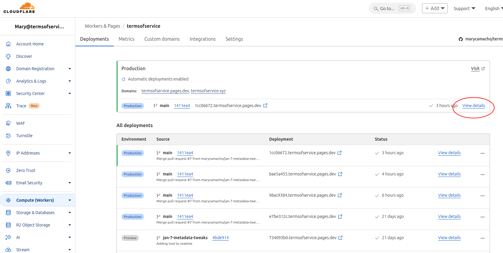
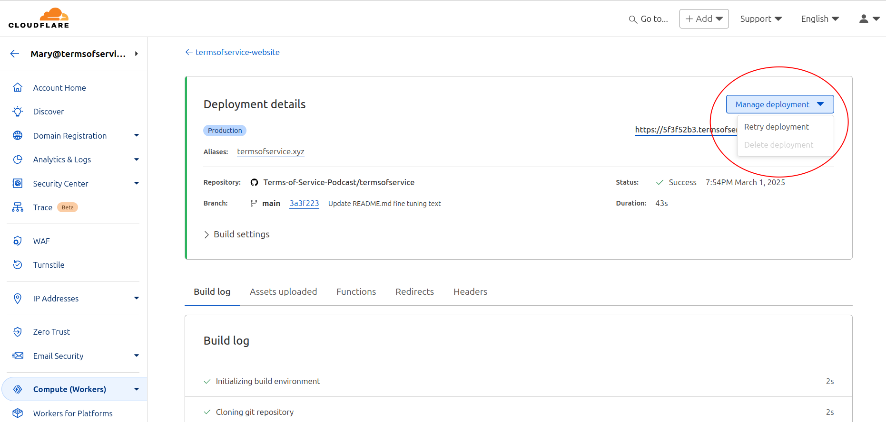

# termsofservice
Static site for the Terms of Service podcast website. Generated with [Eleventy](https://www.11ty.dev/) and mostly Markdown and SCSS.

## Notable Libs
- [Eleventy](https://www.11ty.dev/)
- [markdown-it-fenced-divs](@arothuis/markdown-it-fenced-divs) To support fenced divs in markdown.
- [markdown-it-attrs](https://github.com/markdown-it/markdown-it-attrs) To support attributes in markdown.
- [reallysimple](https://github.com/scripting/reallysimple) RSS reading library.

## Setup and Run as a Developer
- Requirements:
  - Node.js
  - NPM or Yarn
- Download source code from [GitHub](https://github.com/marycamacho/termsofservice) to a local directory.
- Install dependencies with `npm install` or `yarn install`.
- Run `npm run dev` or `yarn dev` to start the development server.

## Tools
To test the episode pages these tools are helpful
- https://www.linkedin.com/post-inspector/
- https://developers.facebook.com/tools/debug/sharing/

## How to trigger a redeploy
The site is hosted on Cloudflare. When a new episode is published or something is edited in the microfeed system, you have to tell
Cloudflare to redeploy the site. The steps are:  
- Login to `https://dash.cloudflare.com/login` with a login that has access to admin the TOS site (I use `mary@termsofservice.xyz`)
- Once logged in, in the same browser, put `https://dash.cloudflare.com/52ade2308bac0e96e89e4e762c2a398f/pages/view/termsofservice-website` in the address
  and press `enter`. The result should look like this:
   

- Click on the circled `View Details` link. (see image above)
- Then, in the top right, click on the circled `Manage Deploy` and then on `Retry deployment`.
    

That should redeploy the site.
